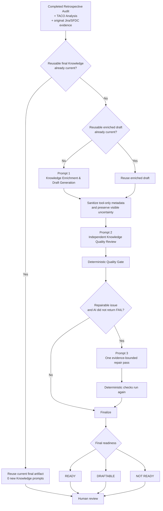
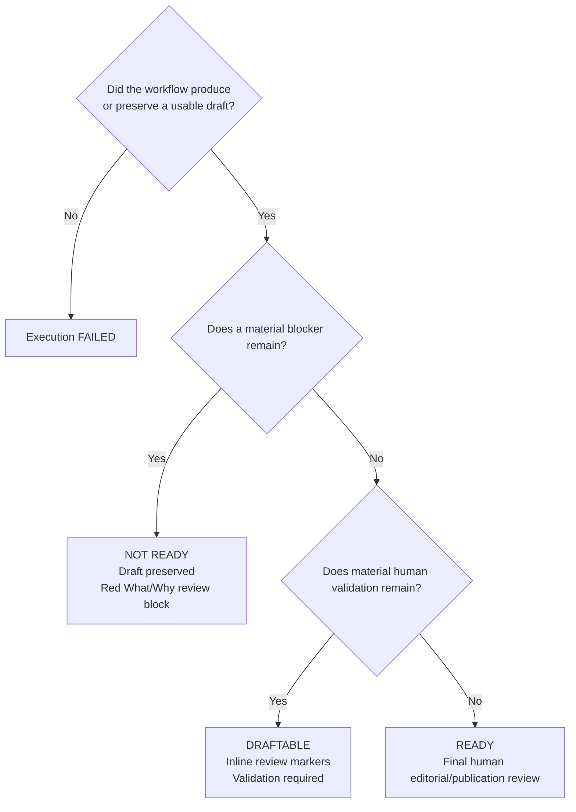

# Knowledge Quality and KCS Generation

The XSUP Auditor does **not** ask AI once to write a KCS and then trust the response.

Knowledge generation is a **multi-stage, evidence-bounded workflow** built on top of the completed retrospective, TACO Analysis, original Jira/SFDC evidence, and Case Chat. A purpose-built/tuned prompt creates the reusable draft, a separate prompt independently reviews it, deterministic code checks the result, one controlled repair pass may run when appropriate, and a human remains responsible for publication.

> **Key principle:** AI helps generate and review the draft. The Auditor controls evidence boundaries, required structure, readiness rules, deterministic safety checks, visible review markers, reuse, and the final human-review boundary.

The workflow produces **review drafts/proposals only**. It does not automatically publish KCS articles, change documentation, or modify Support-owned ticket fields.

---

## 1. The simplest mental model

There are four different kinds of status in the workflow. They should not be confused with one another.

| Layer | Examples | What it answers |
|---|---|---|
| **Execution status** | `queued`, `generating`, `completed`, `failed` | Did the Knowledge job technically run? |
| **Internal AI quality result** | `PASS`, `PASS_WITH_VALIDATION`, `FAIL`, `NOT RE-RUN` | What did the independent AI quality stage report? |
| **Artifact readiness** | **READY**, **DRAFTABLE**, **NOT READY**, **NOT APPLICABLE** | How should a human treat the Knowledge artifact? |
| **Inline review markers** | `SME REVIEW`, `ENGINEERING REVIEW`, `INFERENCE`, etc. | Which exact statement needs attention, and why? |

For normal reviewers, the most important information is:

1. the **Artifact Readiness**;
2. the **inline review markers**;
3. the **Review & Validation Items**.

The internal AI status is useful diagnostic information, but it is not the primary human-facing verdict.

---

## 2. End-to-end Knowledge quality flow



### How many AI prompts are used?

For a **fresh Knowledge generation**, the normal path uses:

| Stage | AI / Case Chat call | When it runs |
|---|---|---|
| **Prompt 1** | Knowledge Enrichment & Draft Generation | Normally runs when a current enriched draft cannot be reused |
| **Prompt 2** | Independent Knowledge Quality Review | Runs for a newly generated/reused enriched draft when a current final artifact cannot be reused |
| **Prompt 3** | One Automatic Repair Prompt | Conditional; runs only when the AI did not return a substantive `FAIL` and deterministic checks find repairable output/quality defects |

Therefore:

- **Typical fresh run:** 2 Knowledge prompts.
- **Fresh run with repair:** 3 Knowledge prompts.
- **Current enriched draft reused:** normally 1 quality prompt, plus the optional repair prompt if needed.
- **Current final quality-reviewed artifact reused:** 0 new Knowledge prompts.

The **Retrospective Audit prompt is separate and upstream**. It is not counted as one of these Knowledge-generation prompts.

> The workflow uses **specialized/tuned prompt instructions** for Support and Knowledge use cases. This is prompt/workflow tuning, not a claim that the underlying model weights are separately fine-tuned.

---

# 3. Stage 0 — The Retrospective decides whether Knowledge should be created

Before the Knowledge worker runs, the Retrospective Audit determines:

- the primary Knowledge action;
- an initial artifact readiness;
- the suggested artifact type;
- the evidence supporting that recommendation;
- known validation boundaries.

Supported Knowledge actions include:

| Knowledge action | Generated artifact |
|---|---|
| `CREATE KCS` | KCS Draft |
| `UPDATE EXISTING KCS` | KCS Update Proposal |
| `UPDATE ADMIN/TECH GUIDE` | Admin / Tech Guide Update Proposal |
| `CREATE/UPDATE RUNBOOK` | Runbook Draft |
| `KNOWN ISSUE/RELEASE NOTE` | Known Issue / Release Note Draft |
| `NO KNOWLEDGE ACTION` | No artifact |
| `UNDETERMINED` | No automatic artifact until the action is resolved |

### Initial readiness versus final readiness

There are two moments where readiness may appear:

1. **Initial Artifact Readiness** — recommended by the Retrospective Audit.
2. **Validated Artifact Readiness** — produced after the Knowledge quality workflow.

For automatic Knowledge generation, the current workflow expects a supported Knowledge action and an initial readiness of **READY** or **DRAFTABLE**.

After generation and quality review, **Validated Artifact Readiness becomes the important human-facing status**.

A draft that entered the pipeline as READY can be downgraded to DRAFTABLE or NOT READY when the quality workflow finds unresolved issues.

---

# 4. Prompt 1 — Knowledge Enrichment & Draft Generation

The first Knowledge prompt is not a generic "summarize this case" request.

Its goal is to convert a **case-specific escalation** into a **reusable technical Knowledge asset**.

It receives the current retrospective and relevant context available through the TACO/Case Chat investigation. It is instructed to:

- identify the reusable technical problem or behavior;
- remove unnecessary customer-specific details;
- retain the technical evidence needed to make the article trustworthy;
- use relevant underlying sources actually available to the investigation;
- choose the appropriate Knowledge format;
- make the content useful to the next engineer;
- avoid treating model inference as product fact;
- keep the output as a draft/proposal for human review.

## Mandatory "At a Glance"

Every generated Knowledge artifact must contain an **At a Glance** section near the top.

It must be:

- 2–3 concise sentences;
- understandable without reading the originating XSUP;
- reusable across customers;
- focused on:
  1. what problem/topic the artifact covers;
  2. the key technical finding/behavior;
  3. what the article helps the reader understand, troubleshoot, configure, or resolve.

It must **not** contain:

- originating XSUP/SFDC IDs;
- source dumps;
- quality-review process commentary;
- validation lists;
- unsupported new facts.

---

# 5. Artifact-specific minimum structure

The deterministic gate requires a minimum structure for each artifact type.

## KCS Draft

```text
At a Glance
Symptoms / Error
Cause
How to Check
How to Confirm
Resolution / Fix
Source References
```

The generation prompt may add other useful sections, such as applicability, verification, expected behavior, additional troubleshooting, examples, related knowledge, or search keywords when supported.

## KCS Update Proposal

```text
At a Glance
Existing Knowledge Reference
Gap Identified
Proposed Additions / Changes
Source References
```

## Admin / Tech Guide Update Proposal

```text
At a Glance
Target Documentation
Documentation Gap
Proposed Documentation Text
Source References
```

## Runbook Draft

```text
At a Glance
Trigger / When to Use
Objective
Investigation Workflow
Decision Points
Source References
```

## Known Issue / Release Note Draft

```text
At a Glance
Issue
Symptoms
Cause / Limitation
Proposed Release Note / Known Issue Text
Source References
```

A heading is not filled with invented content simply to satisfy structure. If the evidence is insufficient, the workflow should omit unsafe claims or clearly identify the validation required.

---

# 6. Source and evidence policy

The Knowledge workflow separates **underlying evidence** from **AI synthesis**.

## Preferred source hierarchy

| Source type | How it should be used |
|---|---|
| **Original Engineering/Jira evidence** | Strong support for Engineering-confirmed behavior, defects, architecture, implementation, fixes, and decisions |
| **Official product documentation** | Strong support for documented configuration, behavior, UI/API usage, supported workflows, and limitations |
| **Original Jira/SFDC case records** | Evidence of what TAC, Engineering, or the customer actually recorded/communicated |
| **Existing KCS / approved internal documentation** | Reusable supporting Knowledge; also used to avoid duplicate articles |
| **Validated prior cases** | Supporting precedent when genuinely relevant |
| **TACO Analysis / Case Chat** | Discovery, synthesis, reasoning, and source-finding mechanism — **not the underlying factual source by itself** |
| **Inference** | Must remain visibly identified until an underlying source establishes it |

### Important rule

A statement is not treated as confirmed merely because TACO or Case Chat said it.

If the article claims:

> Engineering confirmed behavior X.

the workflow should be able to identify the underlying Engineering/Jira evidence that supports that claim.

---

# 7. Pre-quality sanitization

Before the independent quality reviewer evaluates the draft, the Auditor performs basic content sanitization.

Examples of tool-only/internal content include:

```text
[XSUP-AUDITOR-META]
[inference]
[from case data]
[derived analysis]
```

Tool-only reuse metadata is removed automatically and is **not treated as a reason to fail an otherwise useful Knowledge draft**.

Raw provenance labels are converted into human-reviewable uncertainty where appropriate rather than silently pretending that the claim is confirmed.

For example:

```text
[inference]
```

may become:

```text
◇ INFERENCE
```

with an explanation of what needs to be validated.

### Structural issue behavior

If the enriched draft is usable but a structural review issue remains, the workflow:

1. preserves the draft;
2. records the structural review issue;
3. continues to the independent quality-review stage;
4. gives the quality reviewer the issue so it can repair it safely when possible.

A reviewable structural issue is **not automatically treated as a technical job failure**.

---

# 8. Prompt 2 — Independent Knowledge Quality Review

The second prompt is intentionally separate from the generation prompt.

Its role is to act as an **independent technical Knowledge editor**, not simply approve what Prompt 1 wrote.

It evaluates the artifact against a common quality rubric plus an artifact-specific rubric.

## Common quality dimensions

| Quality dimension | What the reviewer checks |
|---|---|
| **Accuracy** | Are factual/operational claims supported by underlying evidence? Is fact separated from inference? |
| **Usefulness** | Can the next intended reader understand the behavior and know what to check or do? |
| **Completeness** | Does the artifact include the information appropriate to its type without inventing material to fill headings? |
| **Actionability** | Are checks/steps specific and ordered? Does the article explain what results mean and what to do next? |
| **Generalization** | Are customer names, tenant IDs, hostnames, one-off timestamps, and case-only details removed from reusable guidance? |
| **Technical depth** | Are commands, APIs, UI paths, versions, configuration values, timings, architecture, and remediation included only when supported? |
| **Source quality & relevance** | Are authoritative/directly relevant sources preferred? Are irrelevant citation dumps avoided? |
| **Consistency** | Do the body, validation items, review markers, and readiness agree with one another? |
| **Readability** | Is the draft concise, structured, non-duplicative, and correctly formatted? |
| **Discoverability** | Is the title/search language symptom-oriented and useful? Are XSUP/SFDC IDs excluded from reusable keywords? |
| **Existing-knowledge awareness** | Does the draft update existing coverage instead of unnecessarily creating duplicate Knowledge? |
| **Audience fit** | Is the language and technical depth appropriate for KCS, documentation, runbook, or known issue readers? |
| **Verification** | Does the article explain how to confirm the diagnosis and verify the outcome when evidence supports it? |
| **Publication boundary** | Does the draft avoid claiming that content is already approved or published? |

---

# 9. Artifact-specific AI quality rules

The common rubric is supplemented by rules for each artifact type.

## KCS

The article should be:

- searchable;
- symptom-oriented;
- resolution-oriented;
- useful for TAC self-service;
- easy to follow from:

```text
symptom
   ↓
applicability / meaning
   ↓
cause
   ↓
check
   ↓
confirm
   ↓
resolve / workaround
   ↓
verify
```

Escalation should not be presented as the primary "resolution" when a supported technical resolution or expected-behavior explanation exists.

## KCS Update

The review checks that:

- the existing article was actually found;
- existing coverage and the new gap are clearly separated;
- the proposal contains focused, ready-to-review additions;
- discoverability is improved where needed;
- unrelated content is not unnecessarily rewritten.

## Admin / Tech Guide Update

The review checks:

- architectural and operational clarity;
- expected behavior;
- configuration implications;
- limitations;
- whether commands/UI/API details are sourced;
- whether the proposed text is usable by a documentation owner without case-specific clutter.

## Runbook

The review checks:

- ordered TAC execution;
- prerequisites;
- evidence interpretation;
- decision points;
- what each result means;
- what the next step should be.

## Known Issue / Release Note

The review checks:

- affected scope;
- observable symptoms;
- impact;
- cause/limitation;
- workaround/fix;
- verification;
- source support for versions, releases, and fix-status statements.

The workflow must not imply a defect or release fix when the evidence only establishes expected behavior or an unverified hypothesis.

---

# 10. Inline review markers

The quality reviewer can annotate the **exact claim** that needs attention.

This is intentionally more useful than putting a generic disclaimer at the bottom of the article.

| Marker | Meaning | Reviewer action | Readiness impact |
|---|---|---|---|
| **⚠ SME REVIEW** | Product behavior, timing, UI path, configuration, or operational detail needs subject-matter validation | Confirm with an SME or authoritative source; rewrite/remove if not supported | Material items prevent READY |
| **⚙ ENGINEERING REVIEW** | Backend, architecture, API, or implementation detail needs Engineering confirmation | Confirm from original Engineering evidence or obtain Engineering review | Material items prevent READY |
| **◇ INFERENCE** | Statement is derived from evidence but not directly established | Find underlying support, move to validation, or remove | Material unresolved inference prevents READY |
| **🔎 SOURCE CHECK** | Claim needs a stronger/more direct source | Find the authoritative source or rewrite/remove | Material items prevent READY |
| **🧭 SCOPE CHECK** | Version, OS, platform, tenant, or applicability is unclear | Confirm scope and narrow wording if necessary | Material items prevent READY |
| **ℹ RECOMMENDATION** | Helpful guidance/best practice, not mandatory product behavior | Confirm appropriateness and keep it framed as guidance | Normally non-blocking |
| **✓ CONFIRMED** | Important claim is directly supported by an appropriate underlying source or Engineering evidence | No additional review unless source/scope changes | Non-blocking |
| **✕ UNSUPPORTED** | Material claim currently lacks sufficient support | Do not publish the claim; support, rewrite, or remove it | **Blocker → NOT READY** |

### Why markers appear beside the statement

A reviewer should not have to compare a long validation list against the full article.

The intended experience is:

```text
Session-triggered synchronization normally completes within 10–15 minutes.
🧭 SCOPE CHECK — confirm whether this timing applies across supported platforms.
```

The exact claim and the exact review requirement remain together.

---

# 11. Internal AI quality result

The independent quality prompt returns a small machine-readable quality envelope before the final artifact:

```text
QUALITY_STATUS: [PASS / PASS_WITH_VALIDATION / FAIL]
VALIDATED_ARTIFACT_READINESS: [READY / DRAFTABLE / NOT READY]
QUALITY_SUMMARY: [one concise sentence]
MATERIAL_VALIDATION_ITEMS: [None / concise list]

--- FINAL ARTIFACT ---
[complete final artifact]
```

## `PASS`

The AI reviewer considers the artifact useful and does not identify a material unresolved validation problem.

`PASS` alone does **not** guarantee READY. Deterministic code checks still run and may downgrade the artifact.

## `PASS_WITH_VALIDATION`

The artifact is useful, but one or more material human-validation items remain.

This normally maps to:

**DRAFTABLE**

## `FAIL`

The quality reviewer considers the content insufficiently safe/useful from the supplied evidence.

A substantive AI `FAIL` is **not automatically repaired by another AI prompt**.

If a usable draft exists, it is preserved for human review and surfaced as:

**NOT READY**

## `NOT RE-RUN`

This may appear in Quality Details when Smart Reuse intentionally reuses a current older Knowledge artifact without rerunning the latest quality workflow.

It means:

- the artifact was source-current and intentionally reused;
- the latest quality workflow was not executed again;
- the reviewer can use **Regenerate Knowledge** to deliberately rebuild it using the current generation + quality pipeline.

This is an internal quality-state explanation, not a publication-readiness label.

---

# 12. Deterministic Quality Gate

After the AI quality reviewer returns its answer, JavaScript independently checks the artifact.

This is important because the AI cannot self-certify its own output.

## Current deterministic checks

| Check | What is validated | Typical impact if it fails |
|---|---|---|
| **Minimum useful content** | Final artifact must contain enough usable material | Can become NOT READY |
| **Internal reuse metadata** | Tool-only reuse metadata must not be visible | NOT READY if it survives final sanitization |
| **Internal placeholder tokens** | No unresolved `@@...@@` machine tokens | NOT READY |
| **Raw provenance labels** | No raw `[inference]`, `[from case data]`, or `[derived analysis]` | NOT READY |
| **Editorial placeholders** | No unresolved `[insert...]`, `[todo...]`, `[tbd...]`, `[placeholder...]` | NOT READY |
| **Markdown code fences** | Triple-backtick fences must be balanced | NOT READY |
| **Required sections** | Artifact-specific mandatory headings must exist | NOT READY |
| **At a Glance** | Must be concise, reusable, and readable | Can trigger repair / downgrade |
| **Correct target** | `Generated From` must match the expected XSUP when present | NOT READY |
| **Search Keywords hygiene** | Originating XSUP/SFDC IDs must not appear as reusable keywords | Quality issue / downgrade |
| **Source References** | Must identify supporting underlying sources | NOT READY |
| **Source mechanism check** | Source References cannot consist only of `TACO` or `Case Chat` | NOT READY |
| **Validation-marker alignment** | Material validation items should be linked to inline review markers | Quality issue / repair |
| **Unsupported marker** | `UNSUPPORTED` cannot remain in an approved artifact | NOT READY |
| **Readiness consistency** | Material validation cannot coexist with READY | Automatically downgraded |

### Minimum-length safeguards

There are small implementation-level content thresholds used to detect obviously unusable responses:

- a draft/final response shorter than the usable-draft threshold is treated as incomplete;
- the final deterministic gate also applies its own minimum-content safeguard.

These thresholds are only **technical sanity checks**. Passing the length check does not mean the article is high quality.

---

# 13. "At a Glance" deterministic checks

The `At a Glance` section has additional code-level checks.

The current gate verifies that it:

- exists;
- contains **2–3 sentences**;
- is not extremely brief;
- is not excessively long;
- does not include an originating `XSUP-...` identifier;
- does not include the SFDC case number;
- does not contain internal process commentary such as:
  - "quality review";
  - "quality gate";
  - "validation items";
  - "Case Chat";
  - "TACO analysis".

This makes the summary useful to an engineer who opens the draft without knowing the originating case.

---

# 14. How the final readiness is calculated

The AI proposes a readiness, but the deterministic gate can override it.

A simplified form of the current logic is:

```text
Start with AI-requested readiness
        │
        ├─ invalid/missing readiness
        │      → default conservatively to DRAFTABLE
        │
        ├─ material validation exists + READY
        │      → downgrade to DRAFTABLE
        │
        ├─ deterministic quality issue + READY
        │      → downgrade to DRAFTABLE
        │
        └─ deterministic blocking issue
               → NOT READY
```

The quality-envelope parser also enforces:

```text
AI status = FAIL
    → NOT READY

AI status = PASS_WITH_VALIDATION
    + AI readiness = READY
    → DRAFTABLE

Material validation items present
    + readiness = READY
    → DRAFTABLE
```

This prevents the model from declaring an artifact READY while simultaneously saying that material validation is still required.

---

# 15. Primary human-facing readiness states

## 🟢 READY

**Meaning**

The generated draft is useful, materially complete, and the automated quality workflow found **no material validation item or blocker remaining**.

Typical characteristics:

- required sections exist;
- important technical claims are appropriately supported;
- no material unsupported claim remains;
- no material SME/Engineering/source/scope validation remains;
- no unresolved internal metadata/provenance issue remains;
- Source References identify underlying sources;
- readiness and validation sections are consistent.

**Reviewer action**

Perform the normal final human editorial/publication review.

> READY does **not** mean "automatically published" or "formally approved."

---

## 🟠 DRAFTABLE

**Meaning**

A useful, reviewable draft exists, but one or more **specific material human-validation items** remain.

Examples:

- exact UI path needs SME validation;
- exact API schema needs Engineering confirmation;
- timing needs scope verification;
- a useful inference needs an underlying source;
- a source needs strengthening.

**Reviewer action**

Resolve the highlighted inline markers and Review & Validation Items.

Example:

```text
Public API tag assignment can be used for this workflow.
⚙ ENGINEERING REVIEW — confirm the supported endpoint/schema for the relevant release.
```

DRAFTABLE is intentionally useful: the engineer does not start from zero; the remaining work is explicitly identified.

---

## 🔴 NOT READY

**Meaning**

A usable draft exists, but a **material blocker** remains. The artifact must not be published as-is.

Examples:

- a required section is materially missing;
- supporting underlying sources are insufficient;
- a material claim is explicitly `UNSUPPORTED`;
- final internal provenance/placeholder content remains;
- the artifact targets the wrong case/context;
- quality finalization could not safely establish publication readiness.

**Current behavior**

NOT READY is **not the same as a failed Knowledge job**.

When a usable draft exists, the Auditor preserves the draft and clearly displays a red review section:

```text
✕ REVIEW REQUIRED

Draft generated successfully — not ready for publication

What to review:
[exact issue]

Why:
[why the issue matters before publication]
```

The purpose is to preserve useful work while making the publication blocker unmistakable.

---

## ⚪ NOT APPLICABLE

**Meaning**

No Knowledge artifact is expected for this retrospective.

Typical reasons:

- `NO KNOWLEDGE ACTION`;
- no supported artifact type applies;
- the Knowledge recommendation has not been established.

NOT APPLICABLE is different from NOT READY:

- **NOT APPLICABLE** = there is no Knowledge artifact to produce.
- **NOT READY** = a draft exists or Knowledge was attempted, but material review/blocker remains.

---

# 16. Execution status versus readiness

Execution status must not be used as a synonym for quality.

Current Knowledge execution states can include:

| Execution status | Meaning |
|---|---|
| `not_evaluated` | Knowledge has not yet been evaluated/run |
| `queued` | Waiting for the Knowledge worker |
| `generating` | Knowledge workflow is active |
| `completed` | The workflow produced/preserved a usable result |
| `outdated` | A source/Audit change means the existing Knowledge should no longer be treated as current |
| `stopped` | Processing was intentionally stopped/interrupted |
| `failed` | The workflow could not produce or preserve a usable artifact |

### Important distinction

These combinations are valid:

```text
Execution: COMPLETED
Readiness: DRAFTABLE
```

and:

```text
Execution: COMPLETED
Readiness: NOT READY
```

The first says a useful draft needs validation.

The second says a usable draft was produced/preserved but is blocked for publication.

`FAILED` should be reserved for genuine execution/generation failure, such as:

- the Knowledge generation request fails before any usable draft exists;
- the service returns no usable draft;
- the workflow cannot preserve a usable artifact.

A quality concern alone is not enough to call the execution failed.

---

# 17. One automatic repair pass

After Prompt 2, deterministic checks may identify issues that are appropriate for a controlled repair.

Examples include:

- missing/incorrect required structure;
- malformed quality envelope;
- raw provenance/metadata hygiene;
- unresolved placeholders;
- source-reference formatting/support problems that can be corrected from already supplied material;
- readiness inconsistency;
- code-fence/formatting problems;
- missing or inconsistent inline review annotation.

When this happens, the workflow may issue **one** repair prompt.

## Repair constraints

The repair prompt is instructed to:

- preserve correct, useful, source-supported content;
- use only the evidence already supplied;
- not create a new diagnosis;
- not broaden the factual basis;
- not invent commands, APIs, UI paths, versions, timing, architecture, fixes, or source claims;
- convert unresolved uncertainty into explicit human validation where appropriate;
- remove unsafe/unnecessary claims;
- repair structure/formatting;
- keep the artifact as a draft for human review.

### Why only one repair pass?

The tool deliberately avoids an open-ended "AI fixes AI indefinitely" loop.

One pass is enough to correct generic output-hygiene defects while keeping the process predictable.

---

# 18. What is **not** auto-repaired

A substantive AI quality `FAIL` is not sent through the automatic repair loop.

For example, if the quality reviewer concludes:

> The available evidence does not support the claimed API behavior.

the system should **not** ask another AI prompt to make the claim appear true.

Instead, the draft should be preserved as **NOT READY** when usable, with the exact issue surfaced to the human reviewer.

The human can then:

- locate an authoritative source;
- obtain SME/Engineering confirmation;
- narrow the claim;
- rewrite it;
- remove it;
- regenerate Knowledge after the evidence changes.

---

# 19. Draft preservation and failure behavior

The workflow is intentionally designed to preserve useful work.

## If a generated enriched draft contains tool-only reuse metadata

The metadata is stripped automatically before review.

It does not cause an otherwise usable draft to fail.

## If the enriched draft has a reviewable structural issue

The workflow records the issue and continues to Prompt 2.

## If the final quality response is not fully valid but contains a usable artifact

The draft is preserved and marked:

**NOT READY**

## If the quality/finalization stage fails after a usable enriched draft already exists

The enriched draft is preserved, downloaded/shown as a review draft, and marked:

**NOT READY**

with the quality-finalization problem explained to the reviewer.

## When does Knowledge actually fail?

Only when the workflow cannot produce or preserve a usable Knowledge artifact.

This keeps these two concepts separate:

```text
Technical execution failure
        ≠
Publication-readiness problem
```

---

# 20. Red "Review Required" block for NOT READY

When the final readiness is NOT READY, the artifact shows a high-visibility red review block.

It explicitly answers:

| Field | Purpose |
|---|---|
| **What to review** | The exact deterministic/quality issue |
| **Why** | Why that issue matters before publication |

Examples of the "Why" explanations include:

- a required part of the reusable article is missing;
- source support is not strong/direct enough;
- a material statement remains unsupported;
- internal provenance syntax must not appear in user-facing Knowledge;
- an unresolved placeholder can make the article misleading;
- malformed code formatting can change/corrupt commands;
- the artifact appears to target the wrong source context;
- quality finalization could not fully validate the final result.

This is different from DRAFTABLE:

- **DRAFTABLE** primarily uses the normal inline SME/Engineering/Inference/Source/Scope markers.
- **NOT READY** adds a prominent red publication-blocker summary.

---

# 21. Readiness decision tree



---

# 22. Examples

## Example A — READY

The article contains:

- supported symptom;
- supported cause;
- supported troubleshooting checks;
- supported resolution;
- complete Source References;
- no material validation markers.

Result:

```text
Execution: COMPLETED
AI Quality: PASS
Readiness: READY
```

Human action:

> Perform final editorial/publication review.

---

## Example B — DRAFTABLE

The core technical conclusion is supported, but the article contains:

```text
The console path is:
Endpoints → All Endpoints → Endpoint Control → ...

⚠ SME REVIEW — verify exact navigation across supported console versions.
```

and:

```text
Session-triggered synchronization generally completes in 10–15 minutes.

🧭 SCOPE CHECK — confirm supported platforms/releases for this timing.
```

Result:

```text
Execution: COMPLETED
AI Quality: PASS_WITH_VALIDATION
Readiness: DRAFTABLE
```

Human action:

> Validate the marked details. Keep, narrow, source, or remove them.

---

## Example C — NOT READY

The draft contains a useful explanation, but a material API claim has no appropriate supporting source.

Result:

```text
Execution: COMPLETED
Readiness: NOT READY

✕ REVIEW REQUIRED

What to review:
Source support for the API behavior is insufficient.

Why:
The affected technical guidance cannot be treated as publication-ready
without an authoritative underlying source or Engineering confirmation.
```

Human action:

> Source, confirm, rewrite, or remove the claim. Do not publish as-is.

---

## Example D — FAILED

Knowledge Case Chat never returns a usable draft and no previously generated usable draft can be preserved.

Result:

```text
Execution: FAILED
```

This is a technical generation/execution problem, not merely a quality-review outcome.

---

# 23. Smart Reuse and quality

The Knowledge workflow is source-driven.

Before making new Case Chat calls, the Auditor checks existing Case Chat history for compatible current artifacts.

## Final Knowledge reuse

If a compatible final quality-reviewed artifact is current, it can be reused without new Knowledge prompts.

## Enriched draft reuse

If a compatible enriched draft is current but no reusable final artifact is available, the draft can be reused and sent to the independent quality stage.

## Why UI/code changes do not automatically regenerate Knowledge

A source-current artifact is not regenerated simply because presentation code or local UI behavior changed.

This avoids unnecessary AI work and duplicate Case Chat entries.

Use:

**Regenerate KCS / Regenerate Knowledge**

when the reviewer deliberately wants a current artifact rebuilt through the current enrichment + quality workflow.

---

# 24. Human publication boundary

No automated readiness state replaces human judgment.

Even **READY** means:

> The automated workflow found no material unresolved quality item.

It does **not** mean:

- formally approved;
- published;
- guaranteed correct forever;
- exempt from normal documentation/KCS governance.

The human reviewer remains responsible for:

- final technical/editorial review;
- validating any organizational publication requirements;
- confirming that the content is appropriate for the intended Knowledge destination;
- publishing through the approved process.

---

# 25. Quick-reference table

| Question | Answer |
|---|---|
| **Do we use one AI prompt to generate KCS?** | No. A fresh run normally uses a generation prompt and a separate independent quality-review prompt. |
| **Can there be a third prompt?** | Yes. One conditional repair prompt may run for repairable non-substantive defects. |
| **Does AI decide quality by itself?** | No. Deterministic JavaScript checks run after the AI reviewer. |
| **Does READY mean published?** | No. READY still requires final human review/publication workflow. |
| **Does DRAFTABLE mean bad KCS?** | No. It means the draft is useful, but named material validation remains. |
| **Does NOT READY mean generation failed?** | No. A usable draft is preserved and the blocking review items are shown in red. |
| **When is the job FAILED?** | When the workflow cannot produce or preserve a usable artifact. |
| **Can TACO be cited as the only factual source?** | No. TACO/Case Chat is the synthesis/discovery mechanism; underlying sources should support material facts. |
| **What happens to inference?** | It must be sourced, marked for review, narrowed, or removed — never silently promoted to confirmed fact. |
| **Can a draft with SME/Engineering review be READY?** | Not when the review item is material. It should be DRAFTABLE. |
| **Can UNSUPPORTED remain in a READY article?** | No. A material `UNSUPPORTED` marker is a blocker. |
| **Why do we reuse existing results?** | To avoid unnecessary AI calls and duplicate Case Chat entries when the source boundary has not changed. |
| **How do I force the latest Knowledge workflow?** | Use **Regenerate KCS / Regenerate Knowledge**. |
| **Who makes the final publication decision?** | A human reviewer. |

---

# 26. Summary

The Knowledge quality design deliberately separates **generation**, **review**, **code validation**, and **human approval**.

```text
Retrospective + Evidence
        ↓
Knowledge Generation Prompt
        ↓
Reusable Enriched Draft
        ↓
Independent Quality Review Prompt
        ↓
Deterministic Quality Gate
        ↓
Optional One-Time Repair Prompt
        ↓
Deterministic Gate Again
        ↓
READY / DRAFTABLE / NOT READY
        ↓
Human Review
```

The key safety and quality properties are:

- two independent AI roles instead of one self-approved response;
- deterministic checks after AI;
- evidence/source discipline;
- artifact-specific structure;
- explicit At a Glance summary;
- exact inline review markers;
- no silent conversion of inference into fact;
- one bounded repair pass;
- useful drafts preserved instead of unnecessarily discarded;
- NOT READY clearly shows **what to review and why**;
- publication remains a human decision.

This allows the workflow to automate repetitive Knowledge work while keeping technical uncertainty, evidence quality, and reviewer responsibility visible.
